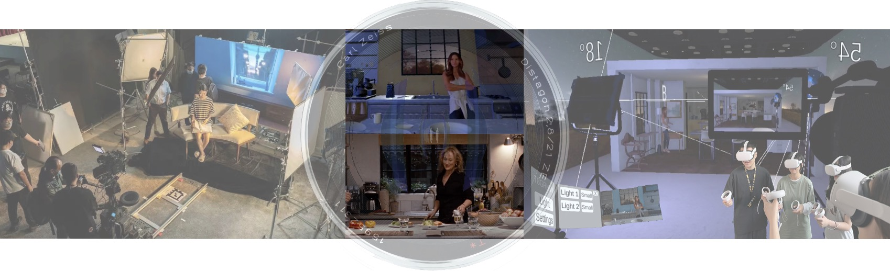

# Cinematography in the Metaverse: Exploring the Lighting Education on a Soundstage

This repo contains the code of ArtMirror.

Lighting education is a foundational component of cinematography education. However, many art schools do not have expensive
soundstages for traditional cinematography lessons. Migrating physical setups to virtual experiences is a potential solution driven
by metaverse initiatives.
That's why we developed Art Mirror, a VR soundstage for teachers and students to emulate cinematography
lighting in virtual scenarios.

## How to run
1. Download the repo
2. Open the repo with Unity (ignore the error for the first open if any)
3. Open the file `LandingScene.unity` in `Assets/Scenes`

## Scenes
1. `LandingScene.unity`: this is the login scene for users to host or join a room.
2. `CrossPlatformNetwork.unity`: this is the main scene for users to teach and learn cinematography.